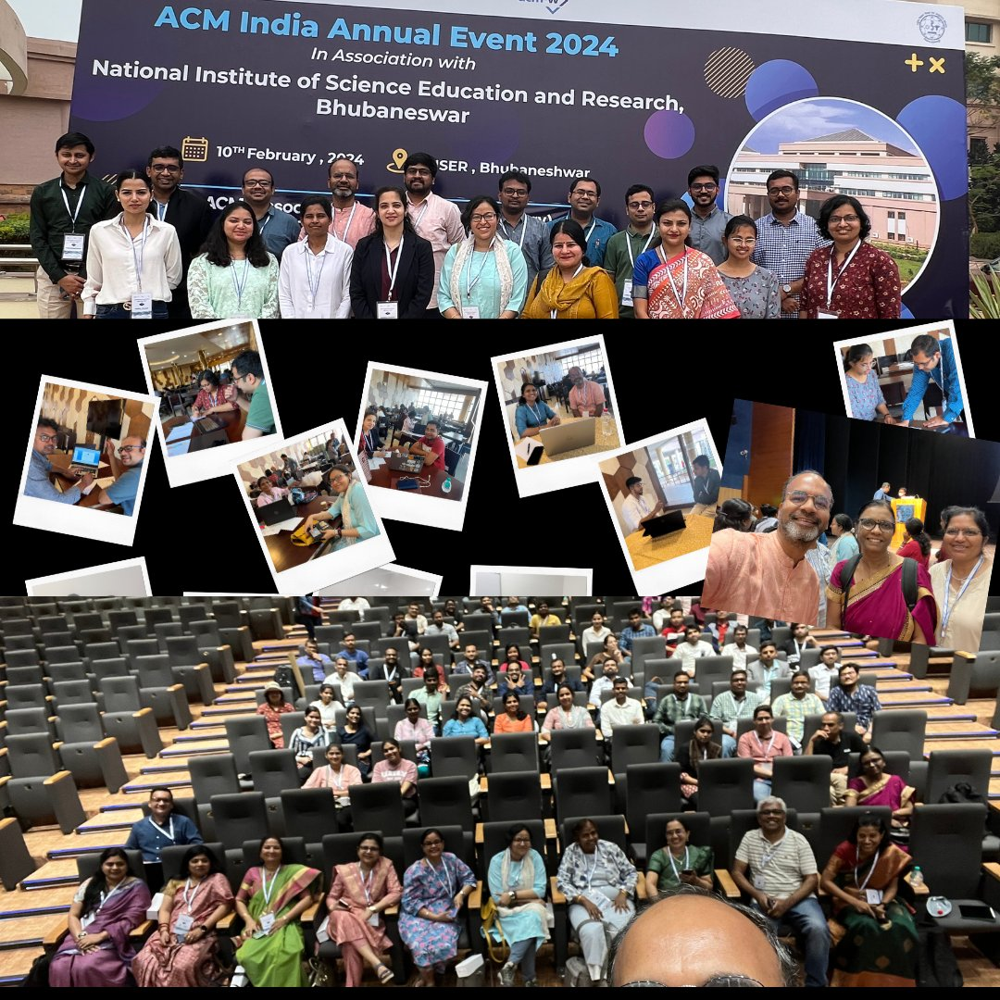

I am a Ph.D student under Prof. C V Jawahar and Prof. Vineeth N Balasubramanian. I belong to the Computer Vision and Information Technology Lab (CVIT) in IIIT Hyderabad. My research interests are in computer vision, machine learning and pattern recognition. My thesis is on the interpretation and analysis of deep face representations. Find my CV <a href="https://drive.google.com/file/d/1JwjkxTJKHVNSEyDRP2gBg07fWJo5rNug/view?usp=sharing">here.</a>.

### Recent Activities
I attended the ACM Academic Research and Careers for Students (ARCS) meeting held from 8-10 February 2024 at NISER, Bhubaneshwar. The meeting included invited talks, poster presentations and PhD Clinic (one-on-one conversations between professors and PhD students).  had one on one talks with Prof. Anirban Chakraborty of IISc Banglore and Prof. Ayon Chakraborty of IIT Madras.

### Research
* John, Thrupthi Ann and Balasubramanian, Vineeth N and Jawahar, C. V. <b> "Explaining Deep Face Algorithms Through Visualization: A Survey," </b> in IEEE Transactions on Biometrics, Behavior, and Identity Science, 2023 | [PDF](https://arxiv.org/pdf/2309.14715.pdf)
* John, Thrupthi Ann and Dua, Isha and Balasubramanian, Vineeth N and Jawahar, C. V. <b>"ETL: Efficient Transfer Learning for Face Tasks"</b>, VISAPP 2022 | [Video](https://www.youtube.com/watch?v=AfrV8P_IMGU&t=2s) | [PDF](http://cdn.iiit.ac.in/cdn/cvit.iiit.ac.in/images/ConferencePapers/2022/ETL_VISSAP.pdf)
* Dua, Isha and John, Thrupthi Ann and Gupta, Riya and Jawahar, C. V. <b>"DGAZE: Driver Gaze Mapping on Road"</b>, IROS 2020 | [Project Page](http://cvit.iiit.ac.in/research/projects/cvit-projects/dgaze) | [Video](https://youtu.be/EoDkxqOhnoQ) | [PDF](http://cdn.iiit.ac.in/cdn/cvit.iiit.ac.in/images/Projects/DGAZE/paper.pdf)
* John, Thrupthi Ann, Balasubramanian, Vineeth N and Jawahar, CV <b>"Canonical Saliency Maps: Decoding Deep Face Models" </b>,| [Video](https://youtu.be/-36xg7KWrDE) | [PDF](https://arxiv.org/abs/2105.01386)
* John, Thrupthi Ann, Dua, Isha, Balasubramanian, Vineeth N and Jawahar, CV. <b>"Low-Cost Transfer Learning of Face Tasks."</b> arXiv preprint arXiv:1901.02675 (2019).| [PDF](https://arxiv.org/abs/1901.02675)

### Datasets
* DGAZE Dataset [Link](http://cvit.iiit.ac.in/research/projects/cvit-projects/dgaze)
* DashGaze Dataset (currently working on)

### Teaching activities
*	Created and taught labs in the ‘Two-week Executive Training Program on AIML’ 2023 by iHub-Data
*	Talk on ‘Explainable AI For Faces’ at Mercedes Benz RnD India
*	Created and taught lab on Generative Adversarial Networks for CVIT Computer Vision Summer School 2017
*	Created and taught lab on Generative Adversarial Networks for CVIT Machine Learning Summer School 2017 and 2018
* Curriculum and labs for 'Foundations of Modern Machine Learning" by IHub-Data and IIIT Hyderabad. I was involved in syllabus creation, content creation, organisation, instruction and lab mentorship. [Link](https://ihub-data.iiit.ac.in/mml2021/)

### Fun projects
* A snake game in Matlab! [Link](https://github.com/ThrupthiAnn/SnakeAI)
* A fun p5js MCQ game to teach Telugu words! [Link](https://editor.p5js.org/ThrupthiAnn/full/7vWC9-uvU)
* A fractal tree logo in p5js! [Link](https://editor.p5js.org/ThrupthiAnn/full/N8na5BnjS)
* Learn factors and multiples using this fun game! [Link](https://editor.p5js.org/ThrupthiAnn/full/tKwT6UkL5)

### Contact me

<a href="twitter.com/annthrupthi" class="btn btn-info btn-block" target="_blank"><i class="icon-comment icon-white"></i> Follow me on Twitter</a>

<a href="https://www.instagram.com/thrupthiann/" class="btn btn-warning btn-block" target="_blank"><i class="icon-picture icon-white"></i> Follow me on Instagram</a>

<a href="https://www.linkedin.com/in/thrupthi-ann-john/?originalSubdomain=in" class="btn btn-primary btn-block" target="_blank"><i class="icon-briefcase icon-white"></i> Connect on LinkedIn</a>

E-mail: thrupthi DOT ann AT research DOT iiit DOT ac DOT in

